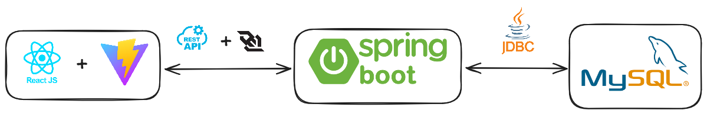
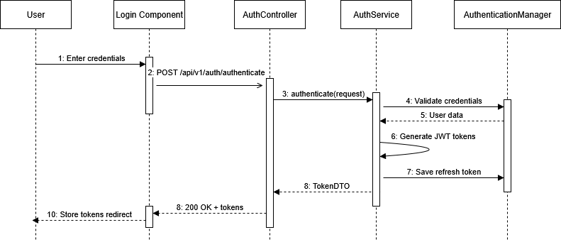
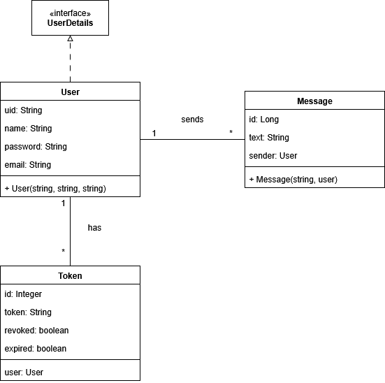
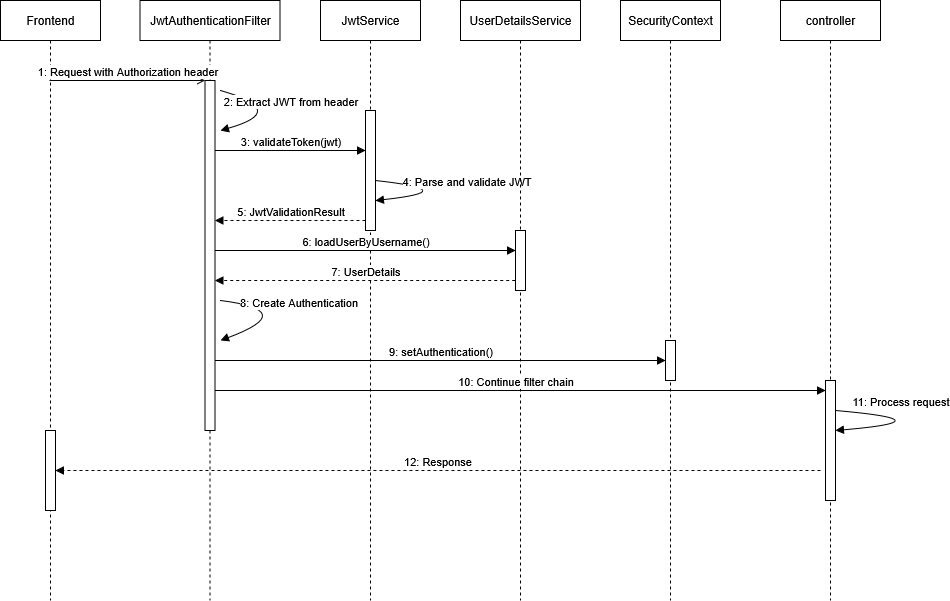
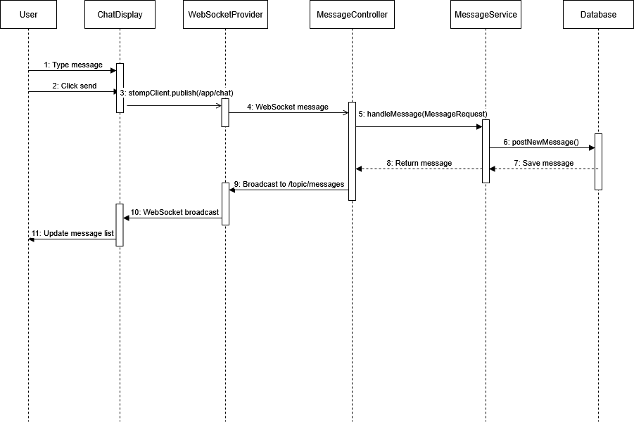
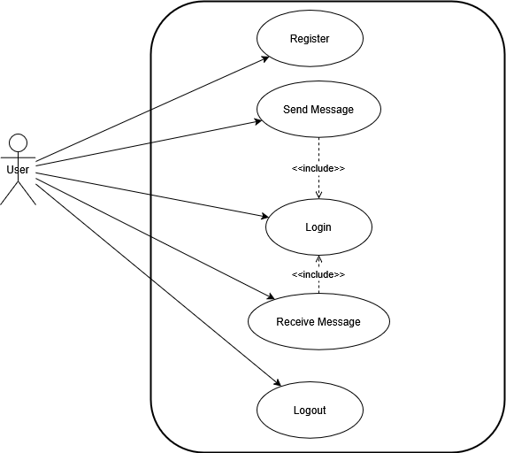

# Chat Application - Backend

A RESTful API backend for a real-time chat application built with Spring Boot. Features JWT authentication, WebSocket messaging, MySQL database integration, and comprehensive security configurations.



## 🚀 Technologies Used

- **Spring Boot 3.3.1** - Application framework
- **Spring Security** - Authentication and authorization
- **Spring WebSocket** - Real-time messaging
- **Spring Data JPA** - Database abstraction
- **MySQL 8.0** - Primary database
- **JWT (JJWT)** - Token-based authentication
- **Flyway** - Database migrations
- **Maven** - Dependency management
- **H2** - In-memory testing database

## 📋 Features

- **JWT-based authentication** with refresh tokens and token rotation
- **Real-time messaging** via WebSocket/STOMP protocol
- **User registration and login** with secure password hashing (BCrypt)
- **Chat view management** - Create and manage group conversations
- **User presence tracking** - Online/offline status with session management
- **Message persistence** - All messages stored in MySQL database
- **Hybrid message delivery** - WebSocket for online users, RabbitMQ queue for offline users
- **Avatar management** - User profile picture support
- **Comprehensive request logging** with MDC (Mapped Diagnostic Context)
- **CORS configuration** for seamless frontend integration
- **Database migrations** with Flyway for version control
- **Unit and integration testing** with H2 in-memory database
- **Docker containerization** for development and production environments
- **Notification system** for chat view events
- **Security filters chain** for authentication and authorization

## 🏗️ Project Structure

```
src/main/java/com/chatapp/chatapp/
├── auth/
│   ├── WebSocketAuthInterceptor.java        # WebSocket STOMP message authentication
│   └── WebSocketHandshakeInterceptor.java   # WebSocket handshake validation
├── config/
│   ├── Config.java               # General configuration & beans (BCrypt, UserDetailsService)
│   ├── CorsConfig.java           # CORS configuration for frontend integration
│   ├── DataInitializer.java      # Application startup data initialization
│   ├── RabbitMQConfig.java       # RabbitMQ message broker configuration
│   ├── SecurityConfig.java       # Spring Security & JWT authentication
│   └── WebSocketConfig.java      # WebSocket/STOMP messaging configuration
├── controller/
│   ├── AuthController.java       # Authentication endpoints (login, register, refresh, logout)
│   ├── ChatViewController.java   # Chat view & messaging endpoints (REST + WebSocket)
│   └── UserController.java       # User management endpoints (avatar, search)
├── dto/
│   ├── AuthRequest.java          # Login request DTO
│   ├── AuthResponse.java         # Login response DTO with access token
│   ├── RegisterRequest.java      # Registration request DTO
│   ├── MessageRequest.java       # Message creation request DTO
│   ├── MessageResponse.java      # Message response DTO (Serializable for RabbitMQ)
│   ├── ChatViewRequest.java      # Chat view creation request DTO
│   ├── ChatViewResponse.java     # Chat view response with user avatars
│   ├── UserResponse.java         # User information response DTO
│   ├── AvatarRequest.java        # Avatar update request DTO
│   ├── AvatarResponse.java       # Avatar response DTO
│   ├── NotificationDTO.java      # System notification DTO
│   ├── TokenInfo.java            # Token transfer DTO (access + refresh cookie)
│   └── JwtValidationResult.java  # JWT validation result with status details
├── entity/
│   ├── User.java                # User entity (implements UserDetails)
│   ├── UserSession.java         # User session & online status tracking
│   ├── Message.java             # Message entity with timestamp
│   ├── ChatView.java            # Chat view/room entity with user relationships
│   └── Token.java               # JWT refresh token storage
├── event/
│   ├── UserCreatedEvent.java           # Event fired when user is created
│   └── UserAddedToChatViewEvent.java   # Event fired when user joins chat
├── filter/
│   ├── JwtAuthenticationFilter.java    # JWT authentication filter (Order=2)
│   ├── LoggingFilter.java              # Request logging filter (Order=1)
│   └── UserContextFilter.java          # User context MDC enrichment (Order=3)
├── listener/
│   ├── ChatViewEventListener.java      # Async chat view event processing
│   └── WebSocketEventListener.java     # WebSocket lifecycle event handling
├── repository/
│   ├── UserRepository.java        # User data access with custom queries
│   ├── MessageRepository.java     # Message data access with chat view queries
│   ├── TokenRepository.java       # Token data access with validation queries
│   ├── ChatViewRepository.java    # Chat view data access with user membership queries
│   └── UserSessionRepository.java # User session data access
├── service/
│   ├── AuthService.java           # Authentication & authorization operations
│   ├── JwtService.java            # JWT token generation, validation, parsing
│   ├── MessageService.java        # Message creation & hybrid delivery (WebSocket + RabbitMQ)
│   ├── ChatViewService.java       # Chat view/room management with authorization
│   ├── UserService.java           # User account & profile operations
│   ├── UserSessionService.java    # User presence & session tracking
│   ├── RabbitMQService.java       # RabbitMQ queue & message management
│   ├── NotificationService.java   # WebSocket notification delivery
│   ├── AuthUtilService.java       # Authentication utility operations
│   └── TestDataService.java       # Test data initialization (dev profile only)
├── util/
│   └── LoggerUtil.java            # MDC logging context management
└── ChatappApplication.java        # Main application class

src/main/resources/
├── application.properties        # Main configuration
├── application-docker.properties # Docker environment config
├── application-dev.properties    # Local  environment config
├── db/migration/                 # Flyway database migrations
│   ├── V1__create_user_table.sql
│   ├── V2__create_user_session_table.sql
│   ├── V3__create_token_table.sql
│   ├── V4__create_chatview_table.sql
│   └── V5__create_message_table.sql

src/test/java/com/chatapp/chatapp/
├── AuthControllerTest.java       # Authentication endpoint tests
├── AuthServiceTest.java          # Authentication service tests
├── JwtServiceTest.java           # JWT service tests
└── test_util/
    └── MockJwtService.java       # JWT mocking utility

Configuration Files:
├── pom.xml                       # Maven dependencies & build
├── compose.yaml                  # Production Docker Compose
├── docker-compose.dev.yml        # Development Docker Compose
├── Dockerfile                    # Production Docker image
├── Dockerfile.dev                # Development Docker image
├── .env.example                  # Environment variables template
└── application-dev.properties.example # Dev config template
```

## 🛠️ Installation & Setup

### Prerequisites
- Java 22
- Maven 3.6+
- MySQL 8.0+
- Docker & Docker Compose (for containerized setup)

### Development Setup

1. **Clone the repository structure**
   ```bash
   # Create parent directory
   mkdir chat-application
   cd chat-application
   
   # Clone both repositories
   git clone <backend-repository-url> chatapp-spring-backend
   git clone <frontend-repository-url> chatapp-react-frontend
   ```

2. **Database Setup (Local Development)**
   ```sql
   CREATE DATABASE chatapp;
   CREATE USER 'chatapp_user'@'localhost' IDENTIFIED BY 'your_password';
   GRANT ALL PRIVILEGES ON chatapp.* TO 'chatapp_user'@'localhost';
   FLUSH PRIVILEGES;
   ```

3. **Environment Configuration**
   ```bash
   cd chatapp-spring-backend
   
   # Copy example files
   cp .env.example .env
   cp application-dev.properties.example src/main/resources/application-dev.properties
   ```
   
   Configure the following variables in `.env`:
   ```env
   # Database Configuration
   DB_URL=jdbc:mysql://localhost:3306/chatapp
   DB_USERNAME=chatapp_user
   DB_PASSWORD=your_password
   DB_PORT=3306
   
   # JWT Configuration
   JWT_SECRET_KEY=your-256-bit-secret-key
   JWT_EXPIRATION=3600000
   JWT_REFRESH_EXPIRATION=604800000
   
   # CORS
   CORS_ALLOWED_ORIGINS=

   UID=1000
   GID=1000

   # Application Ports
   BACKEND_PORT=8080
   FRONTEND_PORT=3000
   
   # API URLs
   VITE_API_BASE_URL=http://localhost:8080/api/v1
   VITE_WS_BASE_URL=http://localhost:8080/ws
   ```
   
   **Configure `application-dev.properties`**:
   
   Edit `src/main/resources/application-dev.properties` with your local settings:
   ```properties
   # Development profile
   spring.datasource.username=chatapp_user
   spring.datasource.password=your_password
   application.security.jwt.secret-key=your-256-bit-secret-key
   application.security.jwt.expiration=3600000
   application.security.jwt.refresh-token.expiration=604800000
   ```
   
   **Note**: Generate a secure JWT secret key using:
   ```bash
   openssl rand -base64 32
   ```

4. **Build the Application**
   ```bash
   # Clean and install dependencies
   ./mvnw clean install
   
   # Or using Maven
   mvn clean install
   ```

5. **Build and Run (Local)**
   ```bash
   # Using Maven wrapper
   ./mvnw spring-boot:run
   
   # Or using Maven
   mvn spring-boot:run
   ```

## 🐋 Docker Setup (Recommended)

### Development Environment
```bash
# From the backend repository directory
docker-compose -f docker-compose.dev.yml up --build
```

This will start:
- Backend application with hot reload
- Frontend application with hot reload  
- MySQL database
- All services networked together

### Production Environment
```bash
# From the backend repository directory
docker-compose up --build
```

This will start:
- Optimized backend application
- Optimized frontend application (built and served via Nginx)
- MySQL database

### Verify Installation
- Backend API: `http://localhost:8080`
- Frontend App: `http://localhost:5173` (dev) or `http://localhost:3000` (prod)
- Database: `localhost:3306`

## 📊 Database Schema

### Users Table
```sql
CREATE TABLE user (
    uid VARCHAR(36) PRIMARY KEY,
    name VARCHAR(255) UNIQUE,
    password VARCHAR(255),
    email VARCHAR(255) UNIQUE,
    avatar_link VARCHAR(255)
);
```

### User Sessions Table
```sql
CREATE TABLE user_session (
    user_uid VARCHAR(36) PRIMARY KEY,
    is_online BOOLEAN NOT NULL,
    websocket_session_id VARCHAR(255),
    last_seen DATETIME,
    FOREIGN KEY (user_uid) REFERENCES user(uid)
);
```

### Chat Views Table
```sql
CREATE TABLE chatview (
    id VARCHAR(36) PRIMARY KEY,
    name VARCHAR(255) NOT NULL
);

CREATE TABLE chatview_users (
    chatview_id VARCHAR(36),
    user_uid VARCHAR(36),
    PRIMARY KEY (chatview_id, user_uid),
    FOREIGN KEY (chatview_id) REFERENCES chatview(id),
    FOREIGN KEY (user_uid) REFERENCES user(uid)
);
```

### Messages Table
```sql
CREATE TABLE message (
    id BIGINT AUTO_INCREMENT PRIMARY KEY,
    text TEXT NOT NULL,
    user_uid VARCHAR(36),
    chatview_id VARCHAR(36) NOT NULL,
    created_at DATETIME(6) NOT NULL,
    FOREIGN KEY (user_uid) REFERENCES user(uid),
    FOREIGN KEY (chatview_id) REFERENCES chatview(id)
);
```

### Tokens Table
```sql
CREATE TABLE token (
    id INT AUTO_INCREMENT PRIMARY KEY,
    token VARCHAR(512),
    revoked BOOLEAN,
    user_uid VARCHAR(36),
    FOREIGN KEY (user_uid) REFERENCES user(uid)
);
```

## 🔐 Authentication & Security

### JWT Configuration
- **Access Token Expiration**: 1 hour (configurable)
- **Refresh Token Expiration**: 7 days (configurable)
- **Secret Key**: Configurable via environment variables

### Security Features
- Password hashing with BCrypt
- Token-based authentication with JWT
- Refresh token rotation and revocation
- CORS configuration for frontend integration
- Comprehensive request/response logging with MDC context
- Filter chain security with custom authentication filters

### Authentication Flow
1. User registers with [`POST /api/v1/auth/register`](src/main/java/com/chatapp/chatapp/controller/AuthController.java)
2. User logs in with [`POST /api/v1/auth/authenticate`](src/main/java/com/chatapp/chatapp/controller/AuthController.java)
3. JWT access token returned in response, refresh token set as HTTP-only cookie
4. Access token used in Authorization header for API authentication
5. Refresh token automatically sent via cookie to obtain new access tokens
6. User logs out with [`POST /api/v1/auth/logout`](src/main/java/com/chatapp/chatapp/controller/AuthController.java) to revoke all tokens

## 📡 API Endpoints

### Authentication (`/api/v1/auth`)
- `POST /api/v1/auth/authenticate` - User login with email and password
- `POST /api/v1/auth/register` - User registration
- `POST /api/v1/auth/refresh` - Refresh access token using refresh token cookie
- `GET /api/v1/auth/validateToken` - Validate current access token
- `POST /api/v1/auth/logout` - User logout (revokes all tokens)

### Chat Views (`/api/v1/chatviews`)
- `POST /api/v1/chatviews` - Create a new chat view/room
- `GET /api/v1/chatviews` - Get all chat views for the authenticated user
- `GET /api/v1/chatviews/{chatViewId}` - Get specific chat view details
- `GET /api/v1/chatviews/{chatViewId}/messages` - Get all messages and purge offline queue
- `GET /api/v1/chatviews/{chatViewId}/messages/queue` - Get and remove queued messages
- `POST /api/v1/chatviews/{chatViewId}/users/{userUid}` - Add user to chat view
- `DELETE /api/v1/chatviews/{chatViewId}/users/{userUid}` - Remove user from chat view
- WebSocket: `/app/chatview/{chatViewId}` - Send message to chat view

### Users (`/api/v1/user`)
- `GET /api/v1/user/avatar` - Get user's avatar URL
- `PATCH /api/v1/user/avatar` - Update user's avatar URL
- `GET /api/v1/user/search?username={username}` - Search for users by username

### WebSocket Configuration
- **Connect**: `/ws`
- **Send Messages**: `/app/chatview/{chatViewId}`
- **Subscribe to Messages**: `/user/queue/chatview/{chatViewId}`
- **Subscribe to Notifications**: `/user/queue/notifications`

## 🔌 WebSocket Configuration

### Connection & Message Flow
1. **Client connects** to `/ws` endpoint with JWT token as query parameter
2. **Handshake validation** verifies token via `WebSocketHandshakeInterceptor`
3. **STOMP authentication** validates each message via `WebSocketAuthInterceptor`
4. **Client sends message** to `/app/chatview/{chatViewId}`
5. **Server processes** via `ChatViewController.handleChatViewMessage()`
6. **Online users** receive message immediately via WebSocket subscription
7. **Offline users** get messages queued in RabbitMQ for later delivery
8. **Client subscribes** to:
   - `/user/queue/chatview/{chatViewId}` - Chat messages
   - `/user/queue/notifications` - System notifications

### WebSocket Endpoints
- **Connect**: `/ws?token=<JWT_ACCESS_TOKEN>`
- **Send Messages**: `/app/chatview/{chatViewId}`
- **Subscribe to Messages**: `/user/queue/chatview/{chatViewId}`
- **Subscribe to Notifications**: `/user/queue/notifications`


## ⚙️ Configuration

### Hybrid Message Delivery Architecture
The application implements a sophisticated hybrid message delivery system:

#### For Online Users:
1. Message is saved to MySQL database
2. Delivered immediately via WebSocket to user's active session
3. User receives message in real-time

#### For Offline Users:
1. Message is saved to MySQL database
2. Message is queued in RabbitMQ with user-specific routing
3. Queue persists until user comes online
4. On connection, user retrieves and purges their message queue
5. Combines queued messages with database messages for complete history

### Environment Variables
All configuration is managed through environment variables defined in `.env` and `application-dev.properties`

### CORS Configuration
Configured in [`CorsConfig.java`](src/main/java/com/chatapp/chatapp/config/CorsConfig.java) to allow frontend requests.

### Test Configuration
- **H2 in-memory database** for testing
- **Test profiles** with separate configuration
- **MockJwtService** in [`test_util/MockJwtService.java`](src/test/java/com/chatapp/chatapp/test_util/MockJwtService.java) for authentication testing
- **Integration tests** for controllers
- **Unit tests** for services

### Test Structure
```
src/test/java/com/chatapp/chatapp/
├── AuthControllerTest.java       # Authentication endpoint tests
├── AuthServiceTest.java          # Authentication service tests
├── JwtServiceTest.java           # JWT service tests
├── LogoutServiceTest.java        # Logout service tests
└── test_util/
    └── MockJwtService.java       # JWT mocking utility
```

## 📊 Logging

### Logging Architecture
The application uses a filter-based logging approach with MDC (Mapped Diagnostic Context)

#### LoggerUtil
Centralized utility in [`LoggerUtil.java`](src/main/java/com/chatapp/chatapp/util/LoggerUtil.java) that provides:
- MDC context setup for HTTP requests (path, client IP, HTTP method)
- User context setup (username)
- Context cleanup after request processing

#### LoggingFilter
Request logging filter in [`LoggingFilter.java`](src/main/java/com/chatapp/chatapp/filter/LoggingFilter.java):
- First filter in the security chain
- Sets up MDC context at the start of each request
- Ensures proper cleanup of logging context
- Provides comprehensive request tracking

#### UserContextFilter
User context filter in [`UserContextFilter.java`](src/main/java/com/chatapp/chatapp/filter/UserContextFilter.java):
- Executes after JWT authentication
- Extracts authenticated user information
- Enriches logs with user-specific details
- Enables user-aware logging throughout the request lifecycle

### Logging Configuration
All logging is configured via [`logback-spring.xml`](src/main/resources/logback-spring.xml) with support for:
- Console and file-based logging
- MDC variables in log patterns (username, path, method, clientIP)
- Different log levels per package
- Request/response tracking with correlation IDs

## 🔧 Database Migrations

### Flyway Migrations
Located in [`src/main/resources/db/migration/`](src/main/resources/db/migration/):
- `V1__Create_user_table.sql` - Initial user table
- `V2__Create_message_table.sql` - Message table
- `V3__Create_token_table.sql` - Token table

## 🚀 Deployment

### Docker Deployment (Recommended)
The application is fully containerized with production-ready Docker configurations:

```bash
# Production deployment
docker-compose up --build

# Development with hot reload
docker-compose -f docker-compose.dev.yml up --build
```

### Manual Deployment
```bash
# Create JAR file
./mvnw clean package

# Run JAR
java -jar target/chatapp-0.0.1-SNAPSHOT.jar
```

## 🛡️ Security Considerations

### Implemented Security Features
- Password hashing with BCrypt
- JWT token expiration and refresh rotation
- Request/response logging

### Additional Security Notes
- All sensitive configuration is externalized to environment variables
- Database credentials are not hardcoded
- JWT secret keys should be properly generated and secured in production

## 🐛 Troubleshooting

### Common Issues

1. **Database Connection Errors**
   - Verify MySQL is running (check with `docker-compose ps`)
   - Check connection parameters in `.env`
   - Ensure database exists and user has permissions

2. **JWT Token Issues**
   - Verify JWT secret key configuration
   - Check token expiration settings
   - Clear browser cookies and try again

3. **WebSocket Connection Problems**
   - Check CORS configuration in [`CorsConfig.java`](src/main/java/com/chatapp/chatapp/config/CorsConfig.java)
   - Verify WebSocket endpoint mapping
   - Test with WebSocket client tools

4. **Docker Issues**
   - Ensure both repositories are in the same parent directory
   - Check Docker compose file paths
   - Verify environment variables are properly set

### Debug Mode
Enable debug logging in environment variables:
```env
LOGGING_LEVEL_ORG_SPRINGFRAMEWORK_WEB=DEBUG
LOGGING_LEVEL_ORG_SPRINGFRAMEWORK_SECURITY=DEBUG
LOGGING_LEVEL_COM_CHATAPP_CHATAPP=DEBUG
```

## 📖 Code Documentation

### Javadoc Documentation
All Java classes, methods, and interfaces in this project are fully documented with comprehensive Javadoc comments.

#### Generating Javadoc:
```bash
# Generate Javadoc HTML documentation
mvn javadoc:javadoc

# View generated documentation
open target/site/apidocs/index.html
```

The generated Javadoc provides a complete API reference for all public classes and methods, making it easy for developers to understand and use the codebase.

## 📚 Documentation

### System Architecture & Diagrams

#### Authentication Flow

*Step-by-step authentication process from login to token generation*

#### Class Diagram

*Entity relationship and class structure showing the domain model*

#### JWT Authentication Flow

*Detailed JWT token validation and authentication filter chain*

#### Message Flow

*Real-time messaging flow through WebSocket connections*

#### Token Refresh Flow

*Token refresh mechanism and authentication flow*

#### Use Case Diagram

*User interactions and system capabilities overview*

## 🔗 Related Projects

- [Frontend Repository](https://github.com/YoungDev7/chatapp-react-frontend) - React frontend application

## 📄 License

This project is licensed under the MIT License.

---

**Note**: This backend is designed to work with the corresponding React frontend. Both applications are orchestrated using Docker Compose for seamless development and deployment.